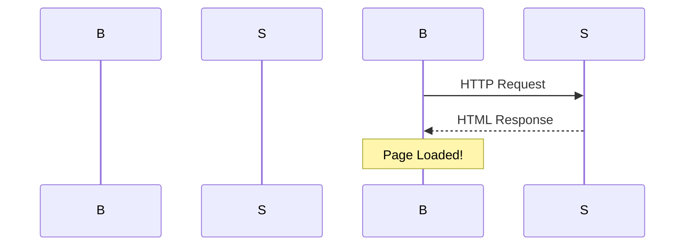

VitePress 是基于 Vite 驱动的静态站点生成器，也是本博客使用的文档框架。本文从基础配置到高级定制全面介绍 VitePress 的使用。

## 为什么选择 VitePress？

```
VitePress vs 其他文档方案:

┌──────────┬  ─────────────┬──────────┐
│ Docusaurus  │  GitBook    │  Hugo     │
│ (React)    │  (MD)      │  (Go)    │
├──────────┼────────────┼──────────┤
│ VitePress  │  MkDocs     │  Astro    │
│ (Vue)     │  (MD)      │  (Astro)  │
└──────────┴────────────┴──────────┘

VitePress 优势:
✅ Vue 生态原生（Composition API / VueUse）
✅ Vite 极速开发体验（HMR 即时）
✅ Markdown 增强（代码高亮 / Mermaid / 自定义容器）
✅ 内置搜索（Algolia / MiniSearch）
✅ i18n 国际化支持
✅ 部署简单（静态文件，任意托管）
```

## 项目初始化

### 快速创建

```bash
# 使用官方脚手架创建
npm create vitepress@latest my-docs

# 或手动搭建
mkdir my-docs && cd my-docs
npm init -y
npm install -D vue @vitepress/theme-default
```

### 最小化目录结构

```
my-docs/
├── .vitepress/                 # VitePress 配置
│   ├── theme/
│   │   └── index.ts         # 主题配置
│   └── config.ts            # VitePress 配置
│
├── docs/                       # 文档源码（Markdown 文件）
│   ├── index.md               # 首页
│   ├── guide/
│   │   ├── getting-started.md
│   │   └── configuration.md
│   │
│   ├── api/
│   │   ├── intro.md
│   │   └── reference.md
│   │
│   └── public/                  # 静态资源
│       logo.svg
│
├── theme/
│   └── custom.css             # 自定义样式覆盖
│
├── components/                # 自定义 Vue 组件
│   └── CustomBlock.vue
│
├── styles/
│   └── extra.scss
│
├── config.ts                   # Vite 配置
├── package.json
└── tsconfig.json
```

## 核心配置

### VitePress 配置 (.vitepress/config.ts)

```typescript
import { defineConfig } from 'vitepress'
import { getSidebar } from './theme/sidebar'
import { getNav } from './theme/nav'

export default defineConfig({
  // 站点标题
  title: 'My Awesome Docs',
  description: 'A powerful documentation site built with VitePress',

  // 语言
  lang: 'zh-CN',

  // 主题
  theme: {
    // 主题色
    color: {
      primary: '#42b983',
      accent: '#476582'
    },
    
    // 导航栏
    nav: getNav(),
    
    // 侧边栏
    sidebar: getSidebar(),
    
    // 社交链接
    socialLinks: [
      { icon: 'github', link: 'https://github.com/myorg/my-docs' },
      { icon: 'twitter', link: 'https://twitter.com/handle' },
    ],
    
    // 编辑链接（用于 GitHub 上编辑）
    editLink: {
      pattern: 'https://github.com/myorg/my-docs/edit/main/docs/:path'
      text: 'Edit this page on GitHub'
    },
    
    // 最后更新时间
    lastUpdated: true,
    docsRepo: 'https://github.com/myorg/my-docs',
    docsDir: 'docs',
  },

  // 构建配置
  build: {
    outDir: '.vitepress/dist',
    mpa: true,           // MPA（多页面应用）
    sitemap: {
      hostname: 'docs.mydomain.com',
      lastmod: true
    },
    // 产物命名
    rollupOptions: {
      output: {
        chunkFileNames: 'assets/[name].[hash].js',
        entryFileNames: '[name].mjs',
      }
    },
    // MetaEnv 变量注入（可在 Markdown 中使用 import.meta.env.VITE_XXX）
    env: {
      SITE_URL: 'https://docs.mydomain.com',
      GA_ID: 'G-XXXXXXXXXX',
    },
  },
})
```

### 导航栏配置

```typescript
// theme/nav.ts
export function getNav(): NavBar {
  return {
    text: 'My Docs',
    items: [
      { text: 'Guide', link: '/guide/', activeMatch: '/guide/' },
      { 
        text: 'API Reference', 
        link: '/api/',
        activeMatch: '/api/',
        items: [
          { text: 'Introduction', link: '/api/intro' },
          { text: 'Core Concepts', link: '/api/concepts' },
          { text: 'Advanced', link: '/api/advanced', badge: 'New!' }
        ]
      },
      { text: 'Examples', link: '/examples/' },
      
      // 外部链接
      { 
        text: 'GitHub',
        link: 'https://github.com/myorg/my-repo',
        icon: 'github'
      }
    ]
  }
}
```

### 侧边栏配置

```typescript
// theme/sidebar.ts
export function getSidebar(): Sidebar {
  return {
    '/': {
      text: '首页',
      items: [
        { text: '快速开始', link: '/' },
      ]
    },
    '/guide/': {
      text: '指南',
      collapsible: true,
      collapsed: false,  // 默认展开
      items: [
        { text: '安装', link: '/guide/getting-started' },
        { 
          text: '基础用法', 
          link: '/guide/basic',
          items: [
            { text: 'Markdown 扩展', link: '/guide/markdown' },
            { text: 'Vue 组件', link: '/guide/components' },
          ]
        },
        { text: '配置', link: '/guide/configuration' },
      ]
    },
    '/api/': {
      text: 'API 参考',
      collapsible: true,
      items: [
        { text: '概述', link: '/api/intro' },
        { text: '参考', link: '/api/ref', badge: 'Complete' },
      ]
    },
  }
}
```

## Markdown 增强功能

### 代码高亮

```
支持的语言标记:

行内代码: \`code\`

代码围栏:
\`\`\`javascript
console.log('Hello VitePress!')
\`\`\`

带语言标识:
\`\`\`python
def hello():
    print("Hello!")
\`\`\`

支持: bash | js | ts | py | json | yaml | sql | css | html
     vue | yml | toml | md
```

### 自定义容器

```html
:::tip 有用的提示
这是一个提示框。适合给出建议或补充信息。
::

:::warning 注意事项
这是一个警告框。提醒用户需要注意的重要信息。
::

:::danger 危险操作
这是一个危险操作框。可能导致不可逆后果。
::
```

### Mermaid 图表支持

```mermaid
graph TD
    A[Start] --> B{Is it working?}
    B -->|Yes| C[Great!]
    B -->|No| D{Fix it}
    D --> C
end
```



### Vue 组件嵌入

```markdown
<!-- docs/guide/components.md -->
<script setup>
import MyComponent from '../components/MyComponent.vue'
import { ref } from 'vue'

const count = ref(0)
</script>

# 使用组件

<MyComponent v-model:count="count" />

<div>Count is: {{ count }}</div>

<button @click="count++">Increment</button>
```

> **重要**：需要在 `.vitepress/config.ts` 中配置允许脚本：

```typescript
// .vitepress/config.ts
export default defineConfig({
  vite: {
    ssr: {
      noExternal: ['@vueuse/core']  // 排除 SSR 不支持的包
    }
  }
})
```

### 插件系统

#### Markdown-it 插件

```bash
npm install -D markdown-it-container
```

```typescript
// .vitepress/config.ts
import container from 'markdown-it-container'

export default defineConfig({
  markdown: {
    container: {
      renderName: 'container',
      validate(params) => {
        if (!params.type || !['info', 'warning', 'danger', 'success'].includes(params.type)) {
              return new Error(`${params.type} is not valid container type`)
            }
          return true
        }
      }
    }
  }
})
```

```markdown
:::info This is an info box with a **bold** word
Content here...
::
```

## 多语言 (i18n) 站点

```bash
npm install -D @nuxtjs/i18n
```

### 目录结构

```
docs/
├── index.md              # 默认语言（中文）
├── en/
│   └── guide/
│       └── getting-started.md
└── ja/
    └── guide/
        └── getting-started.md
```

### 配置

```typescript
import { defineConfig } from 'vitepress'
import { zhCN, en, ja } from '@nuxtjs/i18n'

export default defineConfig({
  locale: {
    fallbackLanguage: 'zh-CN',  // 默认回退语言
    messages: {
      'en': en,
      'ja': ja,
      'zh-CN': zhCN
    },
  },
  locales: {
    '/': {
      label: '简体中文',
      lang: 'zh-CN'
    },
    '/en/': {
      'label: 'English',
      lang: 'en',
      description: 'English Version'
    },
    '/ja/': {
      label: '日本語',
      lang: 'ja',
      description: '日本語バージョン'
    }
  },
  // 导航栏和侧边栏也需国际化！
  theme: {
    nav: {
      // ... 支持多语言
    }
  }
})
```

### Markdown 中的翻译

```markdown
<!-- docs/en/guide/getting-started.md -->
# Getting Started (:::auto)

This is the English version of the getting started guide.

## Build & Deploy

```bash
# 开发
npm run docs:dev

# 构建
npm run docs:build

# 预览构建结果
npm run docs:preview
```

### CI/CD 自动部署示例

```yaml
# .github/workflows/deploy.yml
name: Deploy VitePress to Pages

on:
  push:
    branches: ['main']
  schedule:
  - cron: '0 2 * * *'
    workflow_dispatch:

jobs:
  deploy:
    runs-on: ubuntu-latest
    steps:
      - uses: actions/checkout@v4
      - run: npm ci
      - run: npm run docs:build
      - name: Deploy to GitHub Pages
        uses: peaceiris/actions-gh-pages@v3
        with:
          GITHUB_TOKEN: ${{ secrets.GITHUB_TOKEN }}
          PUBLISH_DIR: ./dist
        publish_dir: ./dist
        enable_sitemap: true
        enable_jekyll: false
        enable_orphan_join: false
        github_token: ${{ secrets.GITHUB_TOKEN }}
```

## 高级定制技巧

### 自定义首页

```vue
<!-- docs/.vitepress/theme/Home.vue -->
<script setup>
import DefaultTheme from '@vitepress/theme-default/out/DefaultHome.vue'
</script>

<DefaultTheme>
  <template #home-hero>
    <h1 class="name">
      <span class="clip">My Awesome Docs</span>
    </h1>
    <p class="text">
      A powerful documentation site built with <a href="https://vitepress.dev/" target="_blank">VitePress</a>.
    </p>
    <div class="actions">
      <a href="/guide/getting-started" class="VPButton medium VPButton alt">
        Get Started
      </a>
      <a href="https://github.com/myorg/my-docs" class="VPButton medium ghost alt">
        View on GitHub
      </a>
    </div>
  </template>
</DefaultTheme>
```

### 自定义 404 页面

```vue
<!-- .vitepress/theme/NotFound.vue -->
<template>
  <div class="not-found">
    <h1>404</h1>
    <p>The page you are looking for could not be found.</p>
    
    <div class="actions">
      <a class="VPButton" href="/" aria-label="go back home">Go Home</a>
    </div>
  </div>
</template>
```

---

## 参考资料

- [VitePress 官方文档](https://vitepress.dev/)
- [VitePress Theme Config](https://vitepress.dev/reference/site-config)
- [VitePress Writing Guide](https://vitepress.dev/guide/writing)
