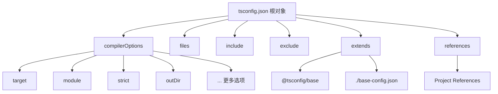
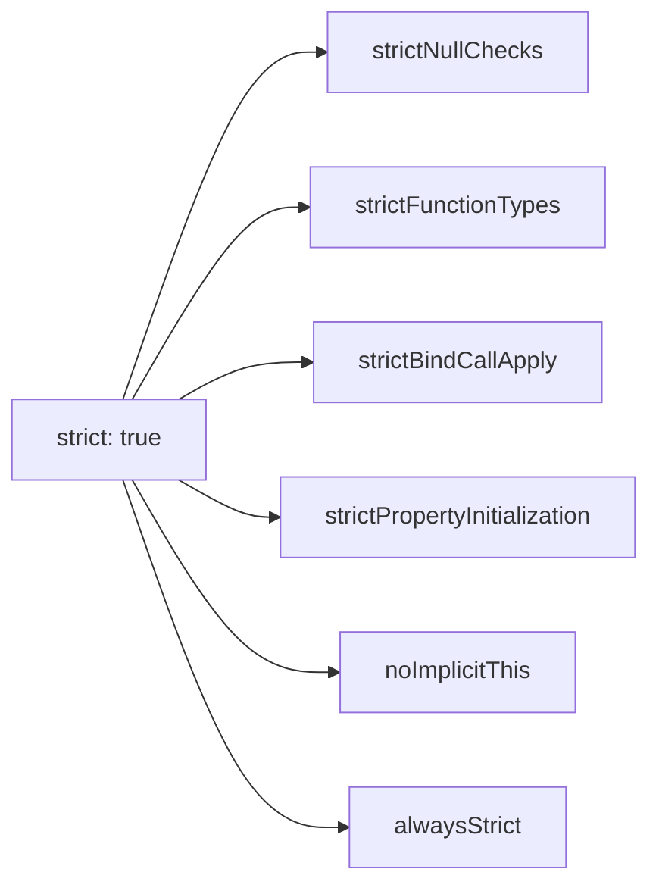
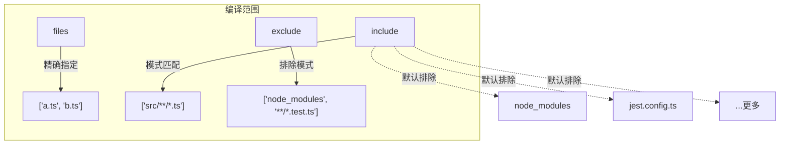

# 编译配置 tsconfig.json——核心选项（target、module、strict、outDir）

## 一、tsconfig.json 是什么？

### 1.1 生活化类比

想象你是一位**大厨**（TypeScript 编译器），而 `tsconfig.json` 就是你的**菜谱/烹饪配方**。它告诉大厨：

- 用什么火候？（target —— 编译到哪个 JS 版本）
- 菜要怎么装盘？（module —— 模块格式）
- 要不要严格按标准操作？（strict —— 严格模式）
- 做好的菜放哪道菜盘里？（outDir —— 输出目录）

没有这个配置文件，大厨就只能用默认方式做饭——可能不是你想要的结果。

### 1.2 技术定义

`tsconfig.json` 是 **TypeScript 编译器（tsc）的配置文件**。它的作用是：

- **定义编译选项**：告诉 tsc 如何将 `.ts` 文件编译成 `.js` 文件
- **指定编译范围**：哪些文件需要被编译，哪些需要排除
- **统一团队规范**：所有开发者使用相同的编译设置

> **关键点**：当项目根目录存在 `tsconfig.json` 时，运行 `tsc` 命令会自动读取该配置进行编译。

## 二、初始化 tsconfig.json

### 2.1 使用 tsc --init

在项目根目录执行：

```bash
npx tsc --init
```

这会生成一个包含**所有可选配置项（带注释）**的 `tsconfig.json` 文件，大约有 **100+ 行**，每个选项都有详细注释说明。

### 2.2 最小可用配置

一个最简单的 `tsconfig.json` 可以只写：

```json
{
  "compilerOptions": {},
  "include": ["src/**/*"]
}
```

甚至更简单——如果不指定 `include/exclude/files`，默认会编译当前目录下（不包括 `node_modules`）的所有 `.ts` 文件。

## 三、配置文件的层级结构



| 属性 | 类型 | 作用 |
|------|------|------|
| `compilerOptions` | Object | **核心**：所有编译选项 |
| `files` | string[] | 显式指定要编译的文件列表 |
| `include` | string[] | 指定要编译的文件模式（支持 glob） |
| `exclude` | string[] | 指定要排除的文件模式 |
| `extends` | string | 继承基础配置文件 |
| `references` | Object[] | 项目引用（多项目管理） |

### 3.1 extends —— 配置继承

```jsonc
{
  // 继承基础配置，然后覆盖或添加自己的选项
  "extends": "@tsconfig/node18/tsconfig.json",
  "compilerOptions": {
    "outDir": "./dist",
    "strict": true
  },
  "include": ["src/**/*.ts"]
}
```

**设计理念**：继承机制让你可以复用社区维护的最佳实践配置（如 `@tsconfig/react-native`、`@tsconfig/next`），然后在此基础上做个性化调整。

## 四、核心编译选项详解（重点）

这是本章最核心的内容。我们将逐一深入每个重要选项。

### 4.1 target —— 编译目标版本

#### 什么是 target？

`target` 决定了 TypeScript 编译器将代码**编译成哪个版本的 JavaScript**。

```typescript
// 源码 (TypeScript)
const name: string = "Alarik";
const greet = () => `Hello, ${name}!`;
```

**target 设为 ES5 时输出：**
```javascript
var name = "Alarik";
var greet = function () { return "Hello, " + name + "!"; };
```

**target 设为 ES2020 时输出：**
```javascript
const name = "Alarik";
const greet = () => `Hello, ${name}!`;
```

可以看到——**target 越高，输出的代码越"原样"，改动越少；target 越低，polyfill 越多**。

#### 可选值一览

| target 值 | 支持的特性 |
|-----------|-----------|
| `ES3` | 最老版本，`var` 声明、函数表达式 |
| `ES5` | `Object.keys()`、`Array.forEach()`、严格模式 |
| `ES6` / `ES2015` | 箭头函数、模板字符串、`let/const`、Promise、类、解构 |
| `ES2016` | 幂运算符 `**` |
| `ES2017` | `async/await`、`Object.entries()`、字符串填充 |
| `ES2018` | 对象展开、异步迭代器、Promise.finally() |
| `ES2019` | `Array.flat()`、`Object.fromEntries()`、可选 catch |
| `ES2020` | 空值合并 `??`、可选链 `?.`、`dynamic import()` |
| `ES2021` | 逻辑赋值、数字分隔符、`String.replaceAll()` |
| `ES2022` | 类字段、顶层 await、`at()` 方法 |
| `ESNext` | 最新支持的特性 |

#### Polyfill 差异示例

```typescript
// 源码
class Animal {
  name: string;
  constructor(name: string) {
    this.name = name;
  }
  speak() {
    return `${this.name} makes a sound`;
  }
}

const cat = new Animal("Kitty");
console.log(cat?.speak());
```

**ES5 输出（大量 polyfill）：**
```javascript
var Animal = /** @class */ (function () {
  function Animal(name) {
    this.name = name;
  }
  Animal.prototype.speak = function () {
    return this.name + " makes a sound";
  };
  return Animal;
}());
var cat = new Animal("Kitty");
console.log((cat === null || cat === void 0 ? void 0 : cat.speak()));
```

类变成了构造函数+原型链，可选链也做了兼容处理。

**ES2020 输出（几乎不变）：**
```javascript
class Animal {
  constructor(name) {
    this.name = name;
  }
  speak() {
    return `${this.name} makes a sound`;
  }
}
const cat = new Animal("Kitty");
console.log(cat?.speak());
```

#### 如何选择合适的 target？

> **生活类比**：就像选择用什么语言和外国朋友聊天——如果对方懂中文就用中文（高 target），如果对方只能听懂基本英语就用简单英语（低 target）。

| 场景 | 推荐 target | 理由 |
|------|-------------|------|
| 现代 Web 应用（Chrome/Firefox/Safari 最新版） | `ES2020` 或 `ESNext` | 现代浏览器已全面支持 |
| 需要兼容 IE11 的老旧系统 | `ES5` | IE 只认识 ES5 及以下 |
| Node.js 项目 | 与 Node 版本对应（见下表） | 直接对应运行时能力 |
| 库/包开发 | `ES5` 或 `ES2015` | 兼容性最大化 |

**Node.js 版本与 target 对应关系：**

| Node.js 版本 | 推荐 target |
|--------------|-------------|
| Node 14+ | ES2020 |
| Node 16+ | ES2021 |
| Node 18+ | ES2022 |
| Node 20+ | ES2023 或 ESNext |

### 4.2 module —— 模块格式

#### 什么是 module？

`module` 决定编译后的 JavaScript 使用**哪种模块系统**来组织代码。

```typescript
// 源码
export const PI = 3.14;
import { add } from "./math";
```

**不同 module 的输出差异：**

| module 值 | 输出格式 | 典型使用场景 |
|-----------|---------|-------------|
| `CommonJS` | `require()` / `module.exports` | Node.js 传统项目 |
| `AMD` | `define([], ...)` | RequireJS 项目 |
| `ES6` / `ES2015` | `import` / `export` | 现代浏览器 + 打包工具 |
| `ES2020` | `import` / `export`（动态 import 支持） | Vite/Webpack 5+ |
| `ESNext` | 最新模块语法 | 现代前端工程 |
| `Node16` / `NodeNext` | 根据 package.json `type` 自动切换 | 现代 Node.js 项目 |
| `System` | `System.register()` | SystemJS 项目 |

#### target 和 module 的配合关系

这是一个**容易踩坑的点**！

```typescript
import { foo } from "bar";
export const result = foo();
```

| target | module | 结果 |
|--------|--------|------|
| ES5 | CommonJS | ✅ 正常工作 |
| ES5 | ES6 | ⚠️ 大多数环境不支持 ES module 语法 |
| ES2020 | CommonJS | ✅ 正常工作（但 import/export 会被转成 require） |
| ES2020 | ESNext | ✅ 最佳现代方案 |
| ES2020 | NodeNext | ✅ Node.js 项目最佳选择 |

> **黄金法则**：`module` 的值应该**不低于** `target` 的值。比如 target 是 ES5，module 就不应该设为 ESNext（因为 ES5 运行时不认识 ES module 语法）。但实际上打包工具（Webpack/Vite）会处理这个问题，所以现代前端项目中通常直接都用 `ESNext`。

#### Node.js 项目 vs 浏览器项目的选择

**Node.js 后端推荐：**
```json
{
  "compilerOptions": {
    "target": "ES2022",
    "module": "NodeNext",
    "moduleResolution": "NodeNext"
  }
}
```
> `NodeNext` 会根据你的 `package.json` 中是否有 `"type": "module"` 来自动决定输出 CJS 还是 ESM。

**浏览器前端推荐：**
```json
{
  "compilerOptions": {
    "target": "ES2020",
    "module": "ESNext",
    "moduleResolution": "bundler"
  }
}
```
> `bundler` 是 TypeScript 5.0 新增的模式，专为 Vite/webpack/Rollup 等打包工具优化。

### 4.3 lib —— 内置 API 定义

`lib` 告诉 TypeScript **哪些内置 API 是可用的**。它不影响编译输出，只影响**类型检查**。

```typescript
// 如果 lib 不包含 "DOM"，下面这行会报错！
const el = document.getElementById("app"); // ❌ Error: Cannot find name 'document'.
```

**常用 lib 组合：**

| 场景 | lib 配置 | 说明 |
|------|----------|------|
| 浏览器端 | `["DOM", "DOM.Iterable", "ES2020"]` | 包含 DOM API |
| Node.js | `["ES2020"]` | 通常不需要额外 lib |
| 完整浏览器 | `["DOM", "DOM.Iterable", "ES2022", "ScriptHost", "Worker"]` | 全套 Web API |
| 默认（不设 lib） | 由 `target` 决定 | target=ES2020 → 包含 ES2020 内置 API |

> **注意**：如果你同时设置了 `target` 和 `lib`，`lib` 会**覆盖** target 自带的 lib。所以一般建议要么不设 lib（让 target 自动决定），要么显式列出需要的 lib。

### 4.4 strict —— 严格模式总开关

`strict: true` 是 TypeScript 的**最重要的质量开关**，它会同时开启以下所有子选项：



让我们逐一了解每个子选项的作用：

#### 4.4.1 strictNullChecks —— 严格的空值检查

**没有开启时：**
```typescript
let name: string = "Alarik";  
name = null;       // ✅ 允许！这可能是个 bug
name = undefined;  // ✅ 也允许！

function greet(who: string) {
  console.log(`Hello, ${who.toUpperCase()}`); 
  // 如果 who 是 null/nullish → 运行时崩溃 💥
}

greet(null!); // 编译通过，运行时报错！
```

**开启后：**
```typescript
let name: string = "Alarik";
name = null;       // ❌ Type 'null' is not assignable to type 'string'
name = undefined;  // ❌ Type 'undefined' is not assignable to type 'string'

// 正确做法：使用联合类型
let nullableName: string | null = "Alarik";
nullableName = null;  // ✅ OK

// 安全地处理可能的空值
function safeGreet(who: string | null | undefined) {
  if (who == null) {  // 同时检查 null 和 undefined
    console.log("Hello, stranger");
    return;
  }
  console.log(`Hello, ${who.toUpperCase()}`); // TS 知道这里 who 一定是 string
}
```

> **为什么这么重要？** JavaScript 中最常见的 bug 来源之一就是 `Cannot read property of null`。`strictNullChecks` 能在编译阶段就捕获这类错误。

#### 4.4.2 strictFunctionTypes —— 严格函数类型检查

```typescript
// 未开启 strictFunctionTypes 时：
type Fn = (x: string) => number;

let fn: Fn = (x) => x.length;   // ✅ 参数类型允许放宽
fn = (x: any) => 42;            // ✅ any 都能过

// 开启 strictFunctionTypes 后：
type FnStrict = (x: string) => number;
let fnStrict: FnStrict = (x) => x.length;  // ✅ OK
// fnStrict = (x: any) => 42;              // ❌ 不允许参数类型放宽
```

**设计理念**：防止函数参数的双向协变导致的意外行为，保证函数类型的类型安全性。

#### 4.4.3 strictBindCallApply —— 严格的 call/apply/bind 检查

```typescript
function sum(a: number, b: number): number {
  return a + b;
}

// 开启后，TS 会严格检查调用时的参数数量和类型
sum.call(undefined, 1, 2);      // ✅ 正确
// sum.call(undefined, 1);        // ❌ 缺少必要参数
// sum.apply(undefined, [1, "x"]); // ❌ 参数类型不对
```

#### 4.4.4 strictPropertyInitialization —— 严格属性初始化检查

```typescript
class User {
  name: string;     // ❌ Property 'name' has no initializer and is not definitely assigned in the constructor.
  age: number;      // ❌ 同上
  
  constructor() {
    this.name = "Alarik";  // 必须在这里初始化
    // age 没初始化 → 报错
  }
}
```

**解决方案：**
```typescript
class User {
  name: string;           // 构造函数中初始化了 → ✅
  age!: number;           // ! 断言符：我承诺稍后会赋值 → ✅
  address?: string;       // 可选属性 → ✅（自动包含 undefined）
  
  constructor() {
    this.name = "Alarik";
  }
  
  setAge(age: number) {
    this.age = age;       // 这里才真正赋值
  }
}
```

#### 4.4.5 noImplicitThis —— 禁止隐式 this

```typescript
// 未开启时：
class Counter {
  count = 0;
  handler = function() {
    console.log(this.count); // ✅ this 可能是 undefined，但 TS 不管
  };
}

// 开启后：
class CounterStrict {
  count = 0;
  handler = function() {
    // console.log(this.count); // ❌ 'this' implicitly has type 'any' because it doesn't have a type annotation.
  };
  
  arrowHandler = () => {
    console.log(this.count); // ✅ 箭头函数的 this 来自外层，类型安全
  };
}
```

#### 4.4.6 alwaysStrict —— 始终启用严格模式

确保编译输出的每个文件都在顶部加上 `"use strict";`，并且以严格模式解析每个文件。

---

### 4.5 outDir / rootDir —— 输出目录控制

```typescript
// 项目结构
project/
├── src/
│   ├── index.ts
│   └── utils/
│       └── helper.ts
├── dist/          ← outDir 指向这里
│   ├── index.js
│   └── utils/
│       └── helper.js
└── tsconfig.json
```

**配置示例：**
```json
{
  "compilerOptions": {
    "rootDir": "./src",   // 源码根目录（保持目录结构）
    "outDir": "./dist"     // 输出目标目录
  }
}
```

> **生活类比**：`rootDir` 是原材料仓库的位置，`outDir` 是成品出货区。编译器把 `rootDir` 下的文件"翻译"好后，保持原有目录结构放到 `outDir` 里。

**注意事项：**
- 如果不设 `rootDir`，默认会用所有非排除文件的最长公共路径作为 root
- `outDir` 中的目录结构会**镜像** `rootDir` 的结构
- 不要把 `outDir` 设置到 `rootDir` 内部（会导致无限循环编译）

### 4.6 sourceMap —— 调试神器

```json
{
  "compilerOptions": {
    "sourceMap": true
  }
}
```

开启后会生成 `.js.map` 文件，让你在浏览器 DevTools 或 VS Code 中**直接调试 TypeScript 源码**，而不是编译后的 JavaScript。

**效果演示：**
```typescript
// src/index.ts 第 10 行
function divide(a: number, b: number): number {
  return a / b; // 在这里打断点
}

divide(10, 0);
```

编译后在浏览器中调试时：
- 你看到的是 **TypeScript 源码**（第 10 行）
- 控制台堆栈显示的是 **.ts 文件名和行号**
- 但实际运行的仍然是编译后的 .js 文件

> **强烈建议**：任何正式项目都应该开启 `sourceMap: true`，调试体验提升巨大。

### 4.7 declaration —— 生成 .d.ts 声明文件

```json
{
  "compilerOptions": {
    "declaration": true,
    "outDir": "./dist"
  }
}
```

当你开发一个库/包给别人用时，这个选项非常重要：

```typescript
// src/math.ts
export function add(a: number, b: number): number {
  return a + b;
}

export const PI = 3.14159;
```

编译后除了生成 `math.js`，还会生成 `math.d.ts`：
```typescript
// dist/math.d.ts（自动生成）
export declare function add(a: number, b: number): number;
export declare const PI: 3.14159;
```

这样使用者安装你的包后就能获得完整的**类型提示**，即使他们不安装源码。

### 4.8 esModuleInterop —— CJS/ESM 互操作

这是**解决 CommonJS 和 ES Module 互操作性问题的神级选项**。

```typescript
// 导入一个 CommonJS 模块（如 lodash）
import _ from "lodash";

// 没有 esModuleInterop 时：
// ❌ Module '"lodash"' has no default export.
// 因为 CommonJS 的 module.exports = _ 不是 ES Module 的 default export

// 有 esModuleInterop 时：
// ✅ 正常工作！TS 会自动处理兼容
```

**底层原理**：开启后，TS 会对导入语句做辅助处理：

```javascript
// 编译前
import _ from "lodash";

// 编译后（CommonJS 模式）
var __importDefault = (this && this.__importDefault) || function (mod) { return (mod && mod.__esModule) ? mod : { "default": mod }; };
var lodash_1 = __importDefault(require("lodash"));
```

> **建议**：除非你有特殊理由，否则**始终开启**此选项。

### 4.9 skipLibCheck —— 跳过声明文件检查

```json
{
  "compilerOptions": {
    "skipLibCheck": true
  }
}
```

跳过 `.d.ts` 声明文件的类型检查，**显著加快编译速度**。

**何时使用？**
- 第三方库的类型声明有错误（很常见），但你无法修改
- 项目依赖很多大型 `@types` 包

**取舍：**
- ✅ 优点：编译速度快很多，不会被第三方类型错误阻塞
- ⚠️ 缺点：第三方库的类型问题不会被发现（但通常不是你能控制的）

> 对于大多数项目来说，**建议开启**。

### 4.10 forceConsistentCasingInFileNames —— 大小写一致性

```json
{
  "compilerOptions": {
    "forceConsistentCasingInFileNames": true
  }
}
```

**场景说明：**

```typescript
// 你有一个文件叫 myUtils.ts
import { help } from "./myUtils";      // ✅ 正确
// import { help } from "./MyUtils";   // ❌ 大小写不一致！
```

**为什么重要？**
- Linux/macOS 的文件系统**区分大小写**（`myUtils.ts` 和 `MyUtils.ts` 是不同文件）
- Windows 的文件系统**不区分大小写**（它们是同一个文件）
- 这个选项能在 Windows 上就捕获大小写不一致的问题，避免代码在其他平台上崩溃

### 4.11 noUnusedLocals / noUnusedParameters —— 未使用检测

```json
{
  "compilerOptions": {
    "noUnusedLocals": true,       // 检测未使用的局部变量
    "noUnusedParameters": true    // 检测未使用的函数参数
  }
}
```

```typescript
function calculate(
  a: number, 
  b: number, 
  unusedParam: number  // ❌ 'unusedParam' is declared but its value is never read.
): number {
  const temp = a + b;
  // const result = temp * 2;  // ❌ 'temp' is declared but its value is never read.
  
  return a + b;
}
```

> **建议**：开发时开启可以帮助保持代码整洁。但如果觉得过于严格（比如某些参数是为未来预留的），可以选择关闭或使用 `_` 前缀忽略。

### 4.12 noImplicitReturns —— 检查隐式返回

```typescript
// 未开启时：
function search(id: number): string | undefined {
  if (id === 1) return "Alice";
  if (id === 2) return "Bob";
  // 函数可能在没有返回值的情况下结束 → 返回 undefined
}

// 开启后：
// ❌ Not all code paths return a value.

// 修正：
function searchFixed(id: number): string | undefined {
  if (id === 1) return "Alice";
  if (id === 2) return "Bob";
  return undefined; // 明确返回
}
```

### 4.13 fallthroughCasesInSwitch —— switch 穿透检测

```typescript
// 未开启时：
switch (status) {
  case "loading":
    showSpinner();
    // 故意不加 break → fall through 到 pending（可能是 bug）
  case "pending":
    showWaiting();
    break;
  case "done":
    hideSpinner();
    break;
}

// 开启后：
// ❌ Fallthrough case in switch.
// 修正：明确标注 intentional fallthrough
switch (status) {
  case "loading":
    showSpinner();
    // falls through  ← 这样就不报错了
  case "pending":
    showWaiting();
    break;
  default:
    break;
}
```

### 4.14 moduleResolution —— 模块解析策略

决定了 TypeScript 如何找到你 `import` 的模块。

```mermaid
graph TD
    A[import "lodash"] --> B{moduleResolution?}
    B -->|Classic| C[相对路径查找]
    B -->|Node| D[node_modules 查找]
    B -->|Node16/NodeNext| E[package.json exports 字段]
    B -->|bundler| F[打包工具友好模式]
    
    D --> D1[找 node_modules/lodash]
    D --> D2[找 node_modules/lodash/package.json main]
    D --> D3[找 node_modules/lodash/index]
```

| 值 | 行为 | 适用场景 |
|----|------|----------|
| `classic` | TypeScript 早期的解析方式 | 已废弃，不建议使用 |
| `node` | 模仿 Node.js 的 require 解析 | Node.js 项目（旧版） |
| `node16` / `nodenext` | 完全遵循 Node.js ESM/CJS 规范 | 现代 Node.js 项目 |
| `bundler` | 类似 node 但对 bare imports 更宽松 | Vite/Webpack/Rollup 前端项目 |

**推荐**：
- Node.js 项目：`"moduleResolution": "NodeNext"`
- 前端项目：`"moduleResolution": "bundler"`

### 4.15 baseUrl / paths —— 路径映射与别名

**痛点**：不用路径别名时，import 路径又臭又长：

```typescript
// 痛苦的方式
import { UserService } from "../../../../../services/user/UserService";
import { format } from "../../../../utils/format";
```

**使用 paths 别名后：**
```typescript
// 清爽的方式
import { UserService } from "@/services/user/UserService";
import { format } from "@/utils/format";
```

**配置方法：**
```json
{
  "compilerOptions": {
    "baseUrl": ".",          // 基础路径（相对于 tsconfig.json 所在位置）
    "paths": {
      "@/*": ["src/*"],      // @/ 映射到 src/
      "@utils/*": ["src/utils/*"],
      "@components/*": ["src/components/*"]
    }
  }
}
```

> **注意**：这只是 **TypeScript 层面的路径映射**，运行时代码仍然需要打包工具（如 Vite/Webpack）或 Node.js 的 alias 配置来配合才能真正解析这些路径。两者需要**同步配置**。

### 4.16 resolveJsonModule —— JSON 模块导入

```json
{
  "compilerOptions": {
    "resolveJsonModule": true
  }
}
```

允许直接导入 `.json` 文件并获得正确的类型推断：

```typescript
// 导入 JSON 文件
import config from "./package.json";

console.log(config.name);     // 类型为 string
console.log(config.version);  // 类型为 string
console.log(config.dependencies); // 类型为 Record<string, string> | undefined
```

### 4.17 isolatedModules —— 确保可单文件编译

```json
{
  "compilerOptions": {
    "isolatedModules": true
  }
}
```

确保你的代码可以被**逐个文件独立编译**（不需要跨文件信息）。

**什么情况会违反这个要求？**
```typescript
// re-export.ts
export { A, B } from "./types";  // ✅ OK

// types.ts
export class A {}
export interface B {}             // ⚠️ isolatedModules 下 interface 不能被 re-export
// 因为 interface 在编译后会消失，re-export 它没有意义

// 修正：改用 type export
export type { B } from "./types"; // ✅ 使用 export type
```

**为什么需要？** 因为像 esbuild、swc 这样的**超快编译器**就是逐文件编译的。开启此选项可以确保你的代码兼容这些工具链。

## 五、include / exclude / files —— 编译范围控制

### 5.1 三者的区别



| 属性 | 类型 | 默认值 | 说明 |
|------|------|--------|------|
| `files` | string[] | 无 | 精确指定文件列表，不支持 glob |
| `include` | string[] | `["**/*"]` | 模式匹配，支持 glob 通配符 |
| `exclude` | string[] | `["node_modules", "bower_components", "jspm_packages"]` + files 中指定的文件 | 从 include 中排除的文件 |

### 5.2 Glob 模式说明

| 模式 | 匹配示例 |
|------|----------|
| `*` | 匹配 0 个或多个字符（不含 `/` 或 `\`） |
| `?` | 匹配恰好 1 个字符 |
| `**/` | 匹配任意层级的目录 |
| `*.ts` | 所有 .ts 文件 |
| `src/**/*.ts` | src 目录及子目录中的所有 .ts 文件 |

### 5.3 实战配置示例

```json
{
  "include": [
    "src/**/*.ts",         // src 目录下所有 .ts 文件
    "tests/**/*.ts"        // 测试文件也要编译
  ],
  "exclude": [
    "node_modules",        // 排除依赖
    "dist",                // 排除输出目录
    "**/*.spec.ts",        // 排除单元测试
    "**/*.test.ts"         // 排除测试文件
  ]
}
```

## 六、extends —— 继承基础配置

### 6.1 社区预设包

npm 上有很多官方和社区维护的 tsconfig 预设：

| 包名 | 适用场景 |
|------|----------|
| `@tsconfig/node18` | Node.js 18 项目 |
| `@tsconfig/node20` | Node.js 20 项目 |
| `@tsconfig/react-native` | React Native |
| `@tsconfig/strictest` | 最严格的 TypeScript 配置 |
| `@tsconfig/tailwind` | Tailwind CSS 项目 |

### 6.2 使用方式

```bash
# 安装预设配置
npm install --save-dev @tsconfig/node18
```

```json
{
  "extends": "@tsconfig/node18/tsconfig.json",
  "compilerOptions": {
    // 覆盖或添加自定义选项
    "outDir": "./dist",
    "baseUrl": ".",
    "paths": {
      "@/*": ["src/*"]
    }
  },
  "include": ["src/**/*.ts"]
}
```

**覆盖规则**：
- 子配置中的 `compilerOptions` 会**合并**（而非替换）父配置
- 同名属性：子配置**覆盖**父配置
- 数组属性（如 `lib`、`types`）：默认**替换**，可以用特殊方式追加

## 七、常用的预设配置方案

### 7.1 前端 Web 项目推荐配置

```jsonc
{
  "compilerOptions": {
    /* 基础 */
    "target": "ES2020",
    "module": "ESNext",
    "moduleResolution": "bundler",
    "lib": ["ES2020", "DOM", "DOM.Iterable"],
    
    /* 严格模式 */
    "strict": true,
    "noUncheckedIndexedAccess": true,

    /* 输出控制 */
    "outDir": "./dist",
    "rootDir": "./src",
    "sourceMap": true,
    "declaration": false,  // 应用项目一般不需要 .d.ts
    
    /* 模块相关 */
    "esModuleInterop": true,
    "allowSyntheticDefaultImports": true,
    "resolveJsonModule": true,
    "isolatedModules": true,

    /* 路径别名 */
    "baseUrl": ".",
    "paths": {
      "@/*": ["src/*"]
    },

    /* 代码质量 */
    "forceConsistentCasingInFileNames": true,
    "skipLibCheck": true,
    "noUnusedLocals": true,
    "noUnusedParameters": true,
    "noImplicitReturns": true,
    "fallthroughCasesInSwitch": true
  },

  "include": ["src/**/*.ts", "src/**/*.tsx"],
  "exclude": ["node_modules", "dist"]
}
```

### 7.2 Node.js 后端推荐配置

```jsonc
{
  "compilerOptions": {
    /* 基础 —— 使用 NodeNext 让 TS 自动适配 ESM/CJS */
    "target": "ES2022",
    "module": "NodeNext",
    "moduleResolution": "NodeNext",

    /* 严格模式 */
    "strict": true,
    
    /* 输出控制 */
    "outDir": "./dist",
    "rootDir": "./src",
    "sourceMap": true,
    "declaration": true,

    /* Node.js 相关 */
    "esModuleInterop": true,
    "resolveJsonModule": true,
    
    /* 代码质量 */
    "forceConsistentCasingInFileNames": true,
    "skipLibCheck": true,
    "noUnusedLocals": true,
    "noImplicitReturns": true
  },

  "include": ["src/**/*.ts"],
  "exclude": ["node_modules", "dist"]
}
```

### 7.3 库/包开发推荐配置

```jsonc
{
  "compilerOptions": {
    /* 基础 —— 兼容性优先 */
    "target": "ES2020",
    "module": "ESNext",
    "moduleResolution": "bundler",
    "lib": ["ES2020"],

    /* 严格模式 */
    "strict": true,

    /* 输出控制 —— 库必须生成声明文件 */
    "outDir": "./dist",
    "rootDir": "./src",
    "declaration": true,
    "declarationMap": true,       // 声明文件的 source map
    "sourceMap": true,

    /* 互操作 */
    "esModuleInterop": true,
    
    /* 质量 */
    "forceConsistentCasingInFileNames": true,
    "skipLibCheck": true
  },

  "include": ["src/**/*.ts"],
  "exclude": ["node_modules", "dist", "**/*.test.ts", "**/*.spec.ts"]
}
```

## 八、配置注释

`tsconfig.json` 天然支持 `//` 注释！这让配置文件变得非常易读：

```jsonc
{
  "compilerOptions": {
    // 🎯 编译目标：我们主要支持 Chrome 和现代浏览器
    "target": "ES2020",
    
    // 📦 模块格式：使用 ESNext，交给打包工具处理
    "module": "ESNext",
    
    // 🔒 严格模式：永远不要关闭！
    "strict": true,
    
    // 📁 输出到 dist 目录
    "outDir": "./dist"
  }
}
```

> 这一点比很多其他配置文件格式（如普通的 JSON）都要人性化。感谢 TS 团队的设计！

## 九、多项目/引用项目（Project References）

当你在管理一个 **monorepo**（多包项目）时，项目引用非常有用：

```
packages/
├── core/           # 核心库
│   ├── src/
│   └── tsconfig.json
├── utils/          # 工具库
│   ├── src/
│   └── tsconfig.json
└── app/            # 主应用
    ├── src/
    └── tsconfig.json
```

**主应用引用核心库：**

```jsonc
// packages/app/tsconfig.json
{
  "compilerOptions": {
    "composite": true,        // 启用项目引用
    "declaration": true,      // 必须生成声明文件
    "strict": true
  },
  "references": [
    { "path": "../core" },    // 引用 core 包
    { "path": "../utils" }    // 引用 utils 包
  ],
  "include": ["src/**/*.ts"]
}
```

**好处：**
- 🔥 **增量编译**：只重新编译有变化的引用项目
- ⚡ **更快构建**：避免不必要的重复编译
- 🔒 **明确的依赖关系**：强制声明项目间的依赖方向

## 十、常见问题和排查方法

### 10.1 TS 找不到 tsconfig.json

**现象**：运行 `tsc` 时提示找不到配置文件。

**排查**：
1. 确认文件名为 `tsconfig.json`（不是 `ts-config.json` 或其他）
2. 确认文件位于**项目根目录**（或在 `--project` 指定的目录中）
3. 确认 JSON 格式正确（没有尾逗号等语法错误）

### 10.2 修改了 tsconfig 但没生效

**原因**：VS Code 的 TypeScript 语言服务有时需要重启。

**解决**：
- 按 `Ctrl+Shift+P` → 输入 `TypeScript: Restart TS Server`
- 或者直接重新打开 VS Code

### 10.3 path alias 不生效

**现象**：配置了 `"@/*": ["src/*"]`，但 import 时仍然报错。

**排查清单**：
1. ✅ tsconfig.json 中的 `paths` 和 `baseUrl` 是否正确？
2. ✅ 是否使用了正确的 `@/` 前缀？
3. ✅ 打包工具是否配置了对应的 alias？（Vite 的 `resolve.alias`，Webpack 的 `resolve.alias`）
4. ✅ `include` 是否包含了你要使用的文件？

### 10.4 target 太低导致代码体积变大

**现象**：编译后的 JS 文件异常大。

**原因**：`target: "ES5"` 会为 async/await、类等特性生成大量 polyfill。

**解决**：根据目标运行环境适当提高 target，或者用打包工具处理 polyfill。

### 10.5 推荐的排查命令

```bash
# 查看 tsc 当前读取的配置
npx tsc --showConfig

# 查看编译了哪些文件
npx tsc --listFiles

# 详细输出编译过程
npx tsc --verbose
```

## 十一、个人总结：好的 tsconfig 是项目质量的基础设施

经过对 `tsconfig.json` 各个选项的深入探索，我想分享几点心得：

### 11.1 三个"永远"

1. **永远开启 `strict: true`** —— 这是 TypeScript 价值的根本所在。关掉它就像买了一辆法拉利却只用第一档开。
2. **永远开启 `skipLibCheck: true`** —— 除非你是类型定义的贡献者，否则别让第三方的类型错误阻塞你的开发。
3. **永远开启 `forceConsistentCasingInFileNames: true`** —— 这是一个零成本的保险，避免跨平台协作的隐形炸弹。

### 11.2 配置即文档

一个好的 `tsconfig.json` 加上清晰的注释，本身就是一份**项目规范文档**。新成员加入团队时，看一眼配置文件就能理解：
- 项目的目标运行环境是什么
- 代码质量要求有多严格
- 模块组织方式是怎样的

### 11.3 渐进式的策略

如果你接手了一个**没有严格模式的旧项目**，不要试图一次性全部修复。建议的渐进路线：


每一步都是独立的改进，可以在 PR 中逐步推进，而不是一次性制造几百个编译错误。

### 11.4 最后的建议

> **tsconfig.json 不只是一份配置文件——它是你和 TypeScript 编译器之间的"契约"。花时间理解每一个选项的含义，会在未来的开发中无数次回报你。**

记住：**配置做得好，bug 自然少**。一个好的 `tsconfig.json` 是高质量 TypeScript 项目的基础设施。
