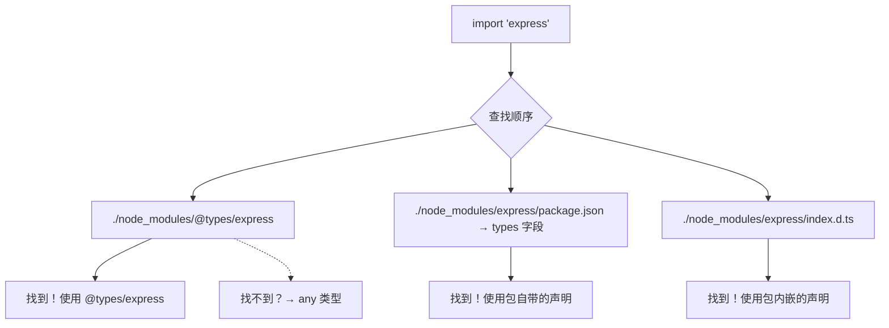
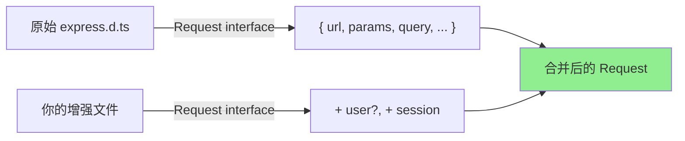

# 声明文件与 @types——使用第三方库的类型定义

## 一、什么是声明文件（Declaration File）？

### 1.1 生活化类比

想象你是一位**翻译官**（TypeScript），你的工作是帮人们阅读**外文书籍**（JavaScript 库）。

- **JavaScript 库** = 一本用某种外语写的书（没有类型信息）
- **声明文件（.d.ts）** = 这本书的**翻译注释版**（标注了每个词的词性、含义和用法）
- **没有声明文件** = 你只能猜测这本书在说什么，容易理解错误

当你拿到一本没有翻译注释的外文书时，你只能通过上下文去猜——这就像 TypeScript 面对一个没有类型的 JavaScript 库时，它不知道这个库导出了什么函数、参数是什么类型、返回值是什么。

而 `.d.ts` 文件就是那本"翻译注释"，它告诉 TypeScript：
> 这个库有一个 `lodash` 函数，接受一个数组和一个回调函数，返回一个新数组。

### 1.2 技术定义

**声明文件（Declaration File）** 是以 `.d.ts` 为扩展名的特殊 TypeScript 文件。它的特点是：

- **只包含类型信息**，不包含实现代码（没有函数体、变量赋值等）
- 用于描述 **JavaScript 代码的形状（shape）**
- 编译时会**被完全忽略**，不会生成任何 JavaScript 输出

```typescript
// 一个简单的声明文件示例：my-lib.d.ts

// 声明一个全局变量
declare const version: string;

// 声明一个全局函数
declare function greet(name: string): void;

// 声明一个接口
interface UserInfo {
  id: number;
  name: string;
  email?: string;
}

// 声明一个类
declare class HttpClient {
  constructor(baseURL: string);
  get<T>(url: string): Promise<T>;
  post<T>(url: string, data: unknown): Promise<T>;
}
```

### 1.3 为什么需要声明文件？

JavaScript 是一门**动态类型语言**，运行时没有任何类型信息。当你在 TypeScript 中使用纯 JavaScript 编写的第三方库时：

```typescript
import _ from "lodash"; // lodash 是用纯 JavaScript 写的

// 没有 .d.ts 时：
const result = _.map([1, 2, 3], (n) => n * 2);
// ❌ TS 不知道 _.map 的参数类型是什么
// ❌ TS 不知道返回值是什么类型
// ❌ 没有自动补全，没有类型检查

// 有 .d.ts 时：
const result = _.map([1, 2, 3], (n) => n * 2); // ✅ 完美类型推断
// result 的类型是 number[]
// 参数 n 自动推断为 number
// 有完整的 IDE 智能提示
```

**总结需要声明文件的三大理由：**

| 理由 | 说明 |
|------|------|
| **类型安全** | 在编译阶段就能发现类型错误，而不是等到运行时崩溃 |
| **智能提示** | IDE 可以提供自动补全、参数提示、文档预览 |
| **重构信心** | 改动代码时，类型系统会告诉你所有受影响的地方 |

## 二、声明文件的三种来源

### 2.1 来源一：内置类型（lib.d.ts）

TypeScript 自带了一组内置声明文件，描述了 JavaScript 运行环境提供的 API：

```typescript
// 这些都不需要安装——TypeScript 自带的！

// 内置对象
const arr: Array<number> = [1, 2, 3];        // 来自 lib.es2020.d.ts
const date: Date = new Date();                 // 来自 lib.es2020.d.ts
const promise: Promise<string> = fetch("/api"); // 来自 lib.es2020.d.ts

// DOM API（浏览器环境）
const el = document.getElementById("app");      // 来自 lib.dom.d.ts
window.addEventListener("resize", () => {});    // 来自 lib.dom.d.ts
localStorage.setItem("key", "value");          // 来自 lib.dom.d.ts
```

这些内置声明文件的集合由 `tsconfig.json` 中的 `lib` 和 `target` 选项控制（详见上一篇文章）。

### 2.2 来源二：@types/* 包（DefinitelyTyped 社区）

这是**最常用**的声明文件来源。DefinitelyTyped 是一个庞大的社区项目，为成千上万的 npm 包提供了高质量的类型定义。

#### 安装方式

```bash
# 为 Node.js API 安装类型定义
npm install --save-dev @types/node

# 为 React 安装类型定义
npm install --save-dev @types/react @types/react-dom

# 为 Jest 安装类型定义
npm install --save-dev @types/jest

# 为 lodash 安装类型定义
npm install --save-dev @types/lodash
```

#### 自动匹配机制（typeRoots 和 types）

TypeScript 会**自动查找**并加载 `@types` 目录下的声明文件：



**默认查找路径（typeRoots 默认值）：**
- `./node_modules/@types`
- 所有祖先目录的 `node_modules/@types`

#### typesVersions —— 版本适配

有些 `@types` 包支持根据你的 TS 版本提供不同的类型定义：

```jsonc
// node_modules/@types/react/package.json
{
  "name": "@types/react",
  "version": "18.2.0",
  "typesVersions": {
    ">=4.9": { "*": ["ts4.9/*"] },
    ">=4.7": { "*": ["ts4.7/*"] },
    "*": { "*": ["*"] }
  }
}
```

这让类型定义可以针对不同 TS 版本优化（比如利用新版本的语法特性来更精确地表达类型）。

### 2.3 来源三：自己编写声明文件

当一个 npm 包**没有官方或社区维护的声明文件**时，你需要自己写：

```typescript
// src/types/untyped-library.d.ts

// 方式一：模块声明（推荐）
declare module "untyped-lib" {
  export function doSomething(input: string): number;
  export const VERSION: string;
  
  interface Options {
    debug?: boolean;
    timeout?: number;
  }
  
  export function configure(options: Options): void;
}
```

我们会在后面详细讲解各种编写方式。

## 三、声明文件的基本语法

### 3.1 declare var / let / const —— 全局变量声明

用于声明一个存在于**全局作用域**的变量：

```typescript
// global.d.ts
declare const APP_NAME: string;        // 常量
declare let mutableVar: number;         // 可变变量（不常见）
declare var GLOBAL_CONFIG: object;      // 全局配置对象

// 使用
console.log(APP_NAME);     // ✅ 直接使用，不需要 import
GLOBAL_CONFIG = {};        // ✅ 赋值操作
```

**生活类比**：就像在一个城市的公告栏上贴了一张告示："这里有一个叫 APP_NAME 的东西，它是字符串"。所有人都能看到并使用它。

**实际案例**：很多 CDN 引入的库会挂载全局变量：
```html
<!-- 通过 script 标签引入 jQuery -->
<script src="https://code.jquery.com/jquery-3.7.0.min.js"></script>
```

```typescript
// jquery.d.ts（简化版）
declare const $: JQueryStatic;
interface JQueryStatic {
  (selector: string): JQuery;
  ajax(settings: AjaxSettings): Promise<any>;
  // ...
}
```

### 3.2 declare function —— 全局函数声明

```typescript
// global.d.ts
declare function customLog(message: string, level?: "info" | "warn" | "error"): void;
declare function createFactory<T>(initializer: () => T): Factory<T>;

// 使用
customLog("Hello World");
customLog("Something wrong", "error");

const factory = createFactory(() => new Date());
```

**重载函数的声明：**
```typescript
// 很多 JS 库支持多种调用方式
declare function parseDate(input: string): Date;
declare function parseDate(input: number): Date;
declare function function parseDate(input: Date): Date;
// 以上三个合并成一个重载函数

parseDate("2024-01-01");   // ✅
parseDate(1704067200000);  // ✅
parseDate(new Date());     // ✅
```

### 3.3 declare class / interface / type —— 全局类型声明

```typescript
// types.d.ts
// 类声明（只有结构，没有实现）
declare class EventEmitter {
  on(event: string, listener: (...args: any[]) => void): this;
  off(event: string, listener: (...args: any[]) => void): this;
  emit(event: string, ...args: any[]): boolean;
}

// 接口声明
declare interface Request {
  url: string;
  method: "GET" | "POST" | "PUT" | "DELETE";
  headers: Record<string, string>;
  body?: unknown;
}

// 类型别名声明
declare type JsonPrimitive = string | number | boolean | null;
declare type Json = JsonPrimitive | JsonObject | JsonArray;
declare interface JsonObject { [key: string]: Json; }
declare interface JsonArray extends Array<Json> {}

// 使用
const emitter = new EventEmitter();
emitter.on("click", (data) => console.log(data));

function handleRequest(req: Request) {
  console.log(`${req.method} ${req.url}`);
}
```

### 3.4 declare module 'xxx' —— 模块声明（Ambient Module）

这是**最常用的声明方式**，用于为一个没有类型的 npm 包添加类型：

```typescript
// 为一个叫 "awesome-lib" 的包编写声明

// 方式 A：完整类型定义
declare module "awesome-lib" {
  // 导出函数
  export function init(options: InitOptions): AwesomeLib;
  
  // 导出类
  export default class AwesomeLib {
    run(): Result;
    stop(): void;
  }
  
  // 导出接口（供使用者使用）
  export interface InitOptions {
    apiKey: string;
    debug?: boolean;
  }
  
  export interface Result {
    success: boolean;
    data?: unknown;
    error?: string;
  }
}
```

**使用效果：**
```typescript
import AwesomeLib from "awesome-lib";
import { init, type InitOptions } from "awesome-lib";

const options: InitOptions = { apiKey: "xxx" };
const lib = init(options);       // ✅ 完整类型
const result = lib.run();       // ✅ result 类型是 Result
```

**方式 B：速通版本（shorthand）**

如果你暂时不需要精确的类型，只想让 TS 不报错：

```typescript
// 任何导入都不会报错，但所有导出的类型都是 any
declare module "some-untyped-lib";
```

> **注意**：这种方式虽然方便，但失去了类型安全保护。建议只在临时方案中使用，后续应该补充完整类型。

### 3.5 declare namespace —— 命名空间声明

命名空间用于组织**相关的全局声明**，常用于描述**使用全局变量的老式库**：

```typescript
// jquery.d.ts（简化示例）
declare namespace $ {
  function ajax(url: string, settings?: AjaxSettings): Promise<any>;
  
  namespace fn {
    extend(target: any, source: any): any;
  }
  
  interface AjaxSettings {
    method?: string;
    data?: any;
    success?(response: any): void;
    error?(error: any): void;
  }
  
  interface Event {
    preventDefault(): void;
    stopPropagation(): void;
  }
}

// 使用
$.ajax("/api/data", { method: "POST" });
$.fn.extend({}, {});
```

**设计理念**：命名空间本质上是一个**带有层级结构的全局对象模型**。在现代 ES Module 项目中，`declare module` 更常用；但在处理一些遗留的全局库时，`namespace` 仍然很有用。

## 四、三斜线指令

三斜线指令是一种特殊的指令语法，用于**声明依赖关系**：

```typescript
/// <reference types="node" />
/// <reference path="./other-decl.d.ts" />
/// <reference lib="es2020" />
```

### 4.1 reference types —— 引用 @types 包

```typescript
// my-global.d.ts
/// <reference types="node" />  // 告诉 TS 我需要 Node.js 类型
/// <reference types="jest" />  // 告诉 TS 我需要 Jest 类型

declare function test(name: string, fn: () => void): void;
// 现在这里可以使用 Node.js 和 Jest 的类型了
```

> **现代替代方案**：在 `tsconfig.json` 的 `compilerOptions.types` 中列出需要的类型通常更清晰。

### 4.2 reference path —— 引用其他声明文件

```typescript
// main.d.ts
/// <reference path="./base-types.d.ts" />
/// <reference path="./api-types.d.ts" />

// 这里可以使用 base-types 和 api-types 中声明的所有内容
export function process(data: BaseType): ApiResult;
```

### 4.3 reference lib —— 引入内置 lib

```typescript
/// <reference lib="es2020" />
/// <reference lib="dom" />
/// <reference lib="webworker.importscripts" />
```

> 这与 `tsconfig.json` 中设置 `lib` 效果相同，但可以**逐文件指定**。一般很少使用。

## 五、模块增强（Module Augmentation）

有时候你想**扩展已有模块的类型**——比如给 Express 的 `Request` 对象添加自定义属性：

### 5.1 扩展第三方模块

```typescript
// src/types/express.d.ts
import express from "express";

// ⚠️ 这里的声明必须放在一个模块中（需要有 import 或 export）

declare module "express" {
  // 扩展 Express.Request 接口
  interface Request {
    // 添加自定义属性
    user?: {
      id: string;
      role: "admin" | "user";
    };
    session: {
      token: string;
      expiresAt: Date;
    };
  }

  // 扩展 Express.Response 接口
  interface Response {
    success<T>(data: T, message?: string): Response;
    error(message: string, code?: number): Response;
  }
}
```

**使用效果：**
```typescript
// middleware/auth.ts
import { Request, Response, NextFunction } from "express";

function authMiddleware(req: Request, res: Response, next: NextFunction) {
  // req.user 现在有完整的类型提示！✅
  if (req.user?.role === "admin") {
    return res.success({ data: "admin access" });
  }
  res.error("Unauthorized", 401);
  next();
}
```

### 5.2 设计理念

模块增强遵循**声明合并（Declaration Merging）**的原则：



两个同名接口会被**合并**成一个，属性取并集。这就是为什么你可以放心地添加新属性而不影响原有定义。

## 六、global 声明 —— 全局类型扩展

如果你想向**全局作用域**添加类型（而不是某个特定模块），使用 `declare global`：

```typescript
// src/types/global.d.ts
// 注意：文件必须作为模块存在（至少有一个 import/export）

export {};  // 让这个文件成为模块

declare global {
  // 全局接口扩展
  interface Window {
    __APP_CONFIG__: {
      apiUrl: string;
      environment: "development" | "production";
    };
    // 自定义全局方法
    myGlobalMethod(message: string): void;
  }

  // 全局类型
  type Environment = "development" | "staging" | "production";
  
  // 全局常量
  const BUILD_TIME: string;
  
  // 命名空间到全局
  namespace AppUtils {
    function formatDate(date: Date): string;
    function generateId(): string;
  }
}
```

**使用效果：**
```typescript
// 任何地方都可以直接使用
console.log(window.__APP_CONFIG__.apiUrl);

window.myGlobalMethod("Hello!");

const env: Environment = "development";

AppUtils.formatDate(new Date());
```

> **重要**：`declare global` 只能出现在**模块文件**中（即包含 `import` 或 `export` 的文件）。所以你需要加一行空的 `export {}` 来使文件成为模块。

## 七、.d.ts 文件的组织方式

### 7.1 与源码同目录（Internal）

适用于**你自己写的库**，声明文件和实现放在一起：

```
src/
├── utils/
│   ├── math.ts          // 实现
│   └── math.test.ts     // 测试
├── types/
│   ├── index.d.ts       // 公共类型
│   └── utils.d.ts       // 工具类型
├── index.ts             // 入口
└── tsconfig.json
```

```typescript
// src/utils/math.ts
export function add(a: number, b: number): number {
  return a + b;
}
// 不需要单独的 .d.ts —— TS 会从源码自动提取类型
```

### 7.2 types 目录（External）

适用于**为外部包写声明**或**集中管理类型**：

```
project/
├── src/
│   └── ...
├── types/               ← 声明文件专用目录
│   ├── global.d.ts
│   ├── express.d.ts     ← 模块增强
│   ├── untyped-lib.d.ts ← 无类型包的声明
│   └── index.d.ts
├── tsconfig.json
```

**在 tsconfig.json 中引入：**
```json
{
  "include": [
    "src/**/*.ts",
    "types/**/*.d.ts"    // 包含 types 目录
  ]
}
```

### 7.3 发布 @types 包

如果你想把自己的类型定义发布到 DefinitelyTyped：

```
definitely-typed/
└── types/
    └── your-package/
        ├── index.d.ts           ← 主类型定义
        ├── your-package-tests.ts ← 测试文件
        ├── tsconfig.json
        └── README.md
```

> 具体的贡献指南见后文。

## 八、typeRoots 和 types 配置项

这两个选项控制 TypeScript 如何发现和加载类型声明文件。

### 8.1 typeRoots —— 指定类型根目录

默认情况下，TS 会从 `./node_modules/@types` 加载所有类型。你可以自定义：

```json
{
  "compilerOptions": {
    "typeRoots": ["./src/types", "./node_modules/@types"]
  }
}
```

这样 TS 会同时从 `src/types` 和 `node_modules/@types` 加载类型。

### 8.2 types —— 显式指定要加载的包

默认情况下，TS 会加载 `@types` 下**所有**的包。如果只想加载特定的几个：

```json
{
  "compilerOptions": {
    "types": ["node", "jest", "react"]  // 只加载这三个
  }
}
```

设置了 `"types": []`（空数组）则**禁用所有自动加载的 @types**。

> **实际场景**：当 `@types` 目录下有很多包但你只需要其中一部分时，或者某些 `@types` 包之间存在冲突时，显式指定 `types` 很有用。

## 九、skipLibCheck 的作用和取舍

我们在上一篇文章提到过这个选项，这里从声明文件的角度再深入讨论一下。

### 9.1 什么是 skipLibCheck？

开启后，TypeScript 会**跳过所有 .d.ts 文件的类型检查**。

### 9.2 为什么需要它？

```typescript
// 假设 @types/some-lib 有这样的声明
declare function process(data: string): number;
// 但实际上这个库也接受 number 类型的数据

// 你的代码：
process(42); // ❌ skipLibCheck=false 时报错：Argument of type 'number' is not assignable to 'string'
// ✅ skipLibCheck=true 时：编译通过（因为 TS 不再检查 .d.ts 内部的一致性）
```

### 9.3 取舍分析

| 维度 | skipLibCheck: false | skipLibCheck: true |
|------|---------------------|-------------------|
| **类型准确性** | 高——能发现所有类型问题 | 低——可能遗漏类型错误 |
| **编译速度** | 慢——需要检查大量 .d.ts | 快——跳过检查 |
| **开发体验** | 可能被无关的错误干扰 | 更流畅 |
| **适用场景** | 类型定义开发者 | 应用开发者 |

> **我的建议**：对于绝大多数应用项目，**开启 `skipLibCheck: true`**。你不是类型定义的贡献者，第三方库的类型问题不应该阻塞你的开发。

## 十、常见问题与解决方案

### 10.1 找不到声明文件（Could not find a declaration file）

**现象：**
```
Could not find a declaration file for module 'some-lib'. 
'some-lib' implicitly has an 'any' type.
```

**解决方案（按优先级）：**

1. **先尝试安装 @types：**
   ```bash
   npm install --save-dev @types/some-lib
   ```

2. **如果没有对应的 @types，自己写一个：**
   ```typescript
   // src/types/some-lib.d.ts
   declare module "some-lib" {
     export function main(): void;
   }
   ```

3. **快速解决（不推荐长期使用）：**
   ```typescript
   // @ts-ignore
   import something from "some-lib";
   
   // 或者更优雅的方式：
   const something = require("some-lib") as any;
   ```

### 10.2 类型不匹配（声明过时或错误）

**现象：** 明明库的 API 已经变了，但类型声明还是旧的。

```typescript
// @types/old-lib 声明的是 v1 的 API
import oldLib from "old-lib";
oldLib.doSomething({ oldOption: true }); 
// 但实际 v2 已经移除了 oldOption...
```

**解决方案：**

1. **更新 @types 到最新版：**
   ```bash
   npm update @types/old-lib
   ```

2. **覆盖/修正类型（使用模块增强）：**
   ```typescript
   // src/types/old-lib-fix.d.ts
   import OldLib from "old-lib";
   
   declare module "old-lib" {
     // 用正确的签名重新声明
     export default class OldLib {
       doSomething(options: NewOptions): Result;
     }
   }
   
   interface NewOptions {
     newOption: boolean;
   }
   ```

3. **向 DefinitelyTyped 提 PR 修复**（社区贡献者欢迎你！）

### 10.3 声明文件与版本不对应

**现象：** 你用的是 `lodash@4.x`，但装了 `@types/lodash@3.x` 的类型。

**排查步骤：**
```bash
# 查看 lodash 实际版本
npm list lodash

# 查看 @types/lodash 版本
npm list @types/lodash

# 如果不对应，安装正确版本的 @types
npm install --save-dev @types/lodash@latest
```

### 10.4 多个 @types 冲突

**现象：** 两个不同的包都试图声明同一个模块的类型。

```bash
# 比如：
npm install @types/foo-bar  # 定义了 'bar' 模块
npm install @types/baz-qux  # 也定义了 'bar' 模块（重复了！）
```

**解决方案：**

1. **确定哪个是正确的**，卸载另一个
2. **用 types 配置排除冲突项：**
   ```json
   {
     "compilerOptions": {
       "types": ["foo-bar"]  // 只保留这一个
     }
   }
   ```
3. **自己写声明覆盖两者**

## 十一、实战：为一个无类型的 npm 包编写声明文件

假设我们使用了一个叫 `emoji-counter` 的小型 npm 包，它没有类型定义。让我们一步步为它编写声明文件。

### 11.1 先了解这个包的 API

```javascript
// emoji-counter 的 README 说它提供了这些功能：
const counter = require("emoji-counter");

// 初始化计数器
counter.init("🎉");

// 增加计数
count = counter.increment();
console.log(count); // 1

// 减少计数
count = counter.decrement();
console.log(count); // 0

// 重置
counter.reset();

// 获取当前计数
count = counter.getCount();
```

### 11.2 编写声明文件

```typescript
// src/types/emoji-counter.d.ts

// 第一步：声明模块
declare module "emoji-counter" {
  /**
   * 初始化计数器
   * @param emoji 要使用的 emoji 符号
   */
  export function init(emoji: string): void;
  
  /**
   * 增加计数并返回新值
   * @returns 当前计数值
   */
  export function increment(): number;
  
  /**
   * 减少计数并返回新值
   * @returns 当前计数值
   */
  export function decrement(): number;
  
  /**
   * 重置计数器为零
   */
  export function reset(): void;
  
  /**
   * 获取当前计数值
   * @returns 当前计数值
   */
  export function getCount(): number;
}
```

### 11.3 使用并验证

```typescript
// src/app.ts
import * as counter from "emoji-counter";

counter.init("🚀");              // ✅ 正确：string 参数
// counter.init(123);            // ❌ 错误：不能传 number

const count = counter.increment(); // count 的类型是 number ✅
console.log(`Count: ${count}`);   // ✅ 类型安全

counter.reset();                  // ✅ 无参调用

const current = counter.getCount(); // current: number ✅
```

### 11.4 进阶：支持 CommonJS 和 ES Module 双模式

如果这个包既支持 `require()` 又支持 `import`：

```typescript
// src/types/emoji-counter.d.ts
declare module "emoji-counter" {
  export function init(emoji: string): void;
  export function increment(): number;
  export function decrement(): number;
  export function reset(): void;
  export function getCount(): number;
  
  // 同时导出默认（ES Module 兼容）
  const emojiCounter: {
    init(emoji: string): void;
    increment(): number;
    decrement(): number;
    reset(): void;
    getCount(): number;
  };
  export default emojiCounter;
}
```

### 11.5 进阶：泛型和复杂类型

假设这个包还支持自定义存储后端：

```typescript
// src/types/emoji-counter.d.ts

// 定义通用存储接口
interface StorageBackend {
  get(key: string): number | null;
  set(key: string, value: number): void;
  delete(key: string): void;
}

// 配置选项
interface EmojiCounterOptions {
  /** 初始 emoji */
  emoji?: string;
  /** 初始计数值 */
  initialValue?: number;
  /** 自定义存储后端 */
  storage?: StorageBackend;
  /** 计数变化时的回调 */
  onChange?: (newCount: number, oldCount: number) => void;
}

// 计数器实例接口
interface EmojiCounterInstance {
  increment(step?: number): number;
  decrement(step?: number): number;
  reset(): void;
  getCount(): number;
  destroy(): void;
}

// 最终声明
declare module "emoji-counter" {
  export function createCounter(options?: EmojiCounterOptions): EmojiCounterInstance;
  
  // 便捷方法（使用默认配置）
  export function init(emoji?: string): EmojiCounterInstance;
  
  // 导出类型供使用者使用
  export type { EmojiCounterOptions, EmojiCounterInstance, StorageBackend };
}
```

**使用效果：**
```typescript
import { createCounter, type EmojiCounterInstance } from "emoji-counter";

// 完整配置
const counter = createCounter({
  emoji: "⭐",
  initialValue: 100,
  onChange: (newVal, oldVal) => {
    console.log(`Changed from ${oldVal} to ${newVal}`);
  }
});

counter.increment(5); // 增加 5
```

## 十二、DefinitelyTyped 贡献指南简介

如果你想回馈社区，可以为缺少类型定义的 npm 包贡献 `@types` 声明文件。

### 12.1 快速流程


### 12.2 目录结构要求

```
types/
└── your-package-name/          ← 包名（必须与 npm 包名一致）
    ├── index.d.ts              ← 必须有：主类型定义
    ├── your-package-name-tests.ts ← 必须有：测试文件（验证类型正确性）
    ├── tsconfig.json           ← 必须有：继承 DT 的基础配置
    └── README.md               ← 可选：说明文档
```

### 12.3 关键规则

1. **不要实现逻辑**——只写类型，不写函数体
2. **必须包含测试**——确保你的类型声明确实有效
3. **保持最新**——API 变化时要及时更新
4. **使用最新 TS 特性**——DT 总是使用最新的稳定版 TypeScript

### 12.4 本地验证工具

DefinitelyTyped 提供了专门的测试工具：

```bash
# 安装测试工具
npm install -g dtslint

# 运行类型测试
dtslint types/your-package-name
```

### 12.5 提交链接

- GitHub: [https://github.com/DefinitelyTyped/DefinitelyTyped](https://github.com/DefinitelyTyped/DefinitelyTyped)
- 在线编辑器: [https://www.typescriptlang.org/dt/](https://www.typescriptlang.org/dt/) （可以直接在线创建 PR！）

## 十三、个人总结：声明文件是 TypeScript 生态繁荣的关键

### 13.1 回顾核心概念

经过对声明文件系统的全面探索，我们可以梳理出一个清晰的认知框架：

```mermaid
graph TB
    subgraph 声明文件生态系统
        A[内置类型<br/>lib.d.ts] --- B[@types/*<br/>DefinitelyTyped] --- C[自写声明<br/>.d.ts]
        
        B --> D[typeRoots]
        C --> E[module augmentation]
        C --> F[global declaration]
        
        D --> G[tsconfig.json<br/>types/typeRoots]
        E --> H[declare module]
        F --> I[declare global]
    end
    
    J[最终效果:<br/>类型安全 + 智能提示] --> A
    J --> B
    J --> C
```

### 13.2 我的几点心得

**第一：声明文件是桥梁**

声明文件连接了两个世界——**动态的 JavaScript 世界**和**静态的 TypeScript 世界**。没有这座桥梁，TypeScript 就无法对海量的 JS 生态进行类型检查，其价值将大打折扣。这也是为什么我说声明文件是 **TypeScript 生态繁荣的关键基础设施**。

**第二：善用 @types，但也要会自己写**

99% 的情况下，`npm install @types/xxx` 就能解决问题。但剩下的 1%——那些冷门库、公司内部包、刚发布的新包——需要你有能力自己编写声明文件。这是一项值得掌握的技能。

**第三：skipLibCheck 是你的朋友**

不要因为第三方类型声明中的错误而纠结。`skipLibCheck: true` 能让你专注于自己的代码质量，而不是去修复别人家的问题。当然，如果你有能力且有意愿贡献修复，那就更好了！

**第四：模块增强是高级技巧中的必备技能**

在实际项目中，尤其是 Express/Koa/NestJS 等 Node.js 后端框架中，扩展请求/响应对象的类型几乎是必做之事。熟练掌握 `declare module` + 接口合并，会让你的代码更加优雅和安全。

### 13.3 最后的话

> **声明文件看似是 TypeScript 的"配角"，但没有它，TypeScript 的主角光芒就会黯淡许多。正是有了 DefinitelyTyped 社区数千名贡献者的努力，才使得 TypeScript 能够无缝地使用几乎整个 JavaScript 生态系统的库。**

如果你在使用某个 npm 包时发现它缺少好的类型定义，不妨考虑：
1. 先自己写一个满足当前需求 📝
2. 如果觉得写得不错，贡献给 DefinitelyTyped 🤝
3. 帮助更多开发者获得更好的开发体验 🌟

**每一个 `.d.ts` 文件，都是 TypeScript 生态大厦的一块砖瓦。**
